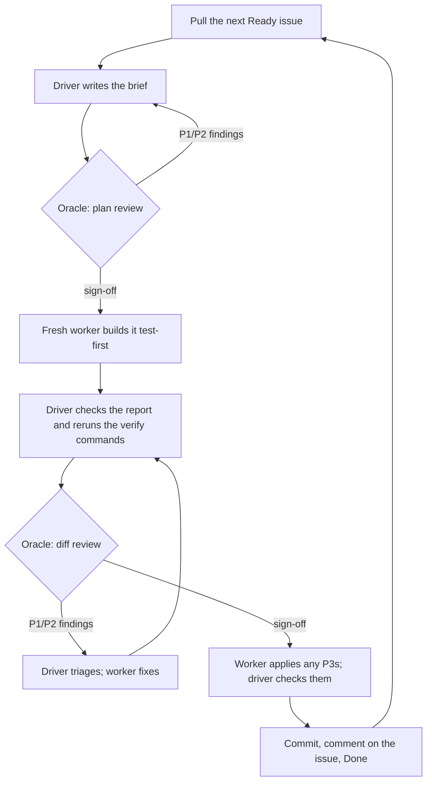

# ai-dev-workflow

Agent skills for building software with three coding agents working as a team: a
**driver** that leads, an **oracle** that reviews, and a **worker** that builds.
Every change goes through a reviewed plan and a reviewed diff before it is
committed, and the work queue lives in [Linear](https://linear.app), where you
decide what gets built.

The agents run side by side in one [Herdr](https://herdr.dev) tab (Herdr is a
terminal multiplexer for coding agents) and talk to each other through it. Any
agent that can load skills can play any role; the author runs Claude Code as
driver, Codex as oracle, and Grok or Claude Code as workers.

| Skill                                                  | What it does                                                                     |
| ------------------------------------------------------ | -------------------------------------------------------------------------------- |
| [`driver`](skills/driver/SKILL.md)                     | Leads the loop: pulls issues, writes briefs, runs reviews, commits, hands off.   |
| [`oracle`](skills/oracle/SKILL.md)                     | Read-only reviewer of briefs, diffs and handoffs, with severity-ranked findings. |
| [`worker`](skills/worker/SKILL.md)                     | Builds one step from a brief, test-first, leaves it uncommitted, reports back.   |
| [`linear-migration`](skills/linear-migration/SKILL.md) | Moves a repository's existing plan (ROADMAP, PLAN, HANDOFF, audit) into Linear.  |

## How it works

### The three roles

```text
┌────────────────────────┬────────────────────────┐
│                        │ oracle                 │
│ driver                 │ reviews briefs, diffs  │
│ picks work, plans,     │ and handoffs; never    │
│ briefs, triages,       │ edits the repository   │
│ commits; the only      ├────────────────────────┤
│ agent that writes to   │ worker                 │
│ Linear                 │ builds one step from   │
│                        │ the brief, test-first  │
└────────────────────────┴────────────────────────┘
```

- **Driver** (left pane): the tech lead. It takes the next released issue,
  splits multi-step issues into sub-issues, writes each step's **brief**,
  triages the oracle's findings, and commits. It writes no code itself.
- **Oracle** (right pane): an independent reviewer. It reads the repository and
  runs checks that leave it unchanged (tests, linters, builds), and replies with
  a verdict and findings ranked P1 to P3. P1 and P2 block a commit; P3 does not.
- **Worker** (below the oracle): builds exactly one step. The driver starts a
  fresh worker for each step, keeps it through that step's fix rounds, and
  closes it after the commit.

### One step, end to end

A **step** is one reviewed commit.



1. **Pull.** At each step boundary the driver re-reads the Linear queue and
   takes the highest-priority `Ready` issue that nothing blocks.
2. **Plan.** It writes the brief (below), sets `Planning`, and sends it to the
   oracle for a `plan` review. If the issue needs several steps, the first brief
   proposes the split, and the driver creates one sub-issue per step.
3. **Build.** Once no P1/P2 plan finding is open, it starts a worker, sends the
   approved brief, sets `Building`, and posts the brief on the issue.
4. **Check.** The worker writes the failing tests first, then the change, runs
   the verify commands, and replies with a fixed report. The driver compares the
   report with the brief, reads the diff, and reruns the checks itself.
5. **Diff review.** `In Review`: the oracle reviews the uncommitted changes. The
   driver sends each finding it agrees with to the worker verbatim. A finding it
   disputes goes to you, not back to the oracle. The driver checks each fix as
   in step 4, then asks for a `re-review`, until sign-off.
6. **Commit.** Sign-off means no P1 or P2 finding is open. The worker applies
   any remaining P3s and the driver checks them, without another review round.
   Then the driver commits with the issue identifier, posts a
   completion comment (commit, verdict, review rounds, each finding's
   disposition, verify results), sets `Done`, and closes the worker.

### The brief

One text with three uses: the oracle approves it, the worker builds from it, and
the Linear issue records it. It is written so that a fresh agent holding only
the repository could build the step:

```text
Brief: <ISSUE-ID> <title>
Repository: <path> @ <base commit>
Goal: what changes and why, in a sentence or two.
Acceptance: observable criteria, one per line.
Files: expected changes and new files.
Tests first: each test to write and the behavior it pins; each fails before the change.
Constraints: project rules binding this step; existing patterns to follow (file:line).
Out of scope: what this step leaves alone.
Verify: commands to run and their expected results.
Stop and report if: conditions where the worker asks instead of choosing.
```

### Chunks and handoffs

A **chunk** is one driver session. After about five steps (sooner after heavy
ones), when the queue is empty, or when you ask, the driver ends the chunk at a
step boundary:

1. It writes `HANDOFF.md` for a fresh driver and oracle: state, queue snapshot,
   sources of truth, decisions in force, operational state, gotchas.
2. The oracle reviews the handoff, and the driver commits it.
3. It restarts the oracle fresh in the same pane, starts a new driver below
   itself, confirms the new driver is `READY`, and hands over. The new driver
   closes the old pane and carries on.

Long sessions degrade; fresh agents with a reviewed handoff do better.

## Linear as the queue

One Linear project per repository. You own priority, order, scope and what is
released; the driver owns every status after `Ready`.

| Status        | Meaning                                  | Set by                                              |
| ------------- | ---------------------------------------- | --------------------------------------------------- |
| `Backlog`     | Ideas and discovered work; not buildable | you; the driver for work it discovers               |
| `Ready`       | Released for building                    | you; the driver for sub-issues of a released parent and for answered `Needs Input` issues |
| `Planning`    | Brief in plan review                     | driver                                              |
| `Building`    | Worker building or fixing                | driver                                              |
| `In Review`   | Diff in oracle review                    | driver                                              |
| `Needs Input` | Waiting on you                           | driver                                              |
| `Done`        | Committed                                | driver                                              |

- **The Ready gate.** Agents build only what you moved to `Ready`. Work the
  driver discovers mid-step goes to `Backlog` with a note, for you to release.
  Releasing a parent issue releases its sub-issues.
- **Reprioritize any time.** The driver re-reads the queue only at step
  boundaries, so a change takes effect at the next step.
- **Questions.** When only you can decide, the driver comments on the issue
  (question, options, recommendation, what it blocks) and sets `Needs Input`.
  During planning it parks the issue and moves on; during building or review it
  waits. Answer with a comment on the issue, or in the driver's pane.
- **`[driver]` prefix.** Linear shows the driver's comments under your account,
  so every comment it posts starts with `[driver]`. An unprefixed comment is
  yours: that is how it spots your answer.

Without a Linear project the loop still works: the queue is your instructions
plus `HANDOFF.md`'s remaining work.

## Setup

### Requirements

- [Herdr](https://herdr.dev), with the agents running inside it (`HERDR_ENV=1`).
- Two or three coding agents that load skills (`SKILL.md` folders), for example
  Claude Code, Codex or Grok.
- `git`, and Python 3 for `linear-migration`'s script template. For the Linear queue: a Linear workspace, and the Linear MCP server
  configured for the agent that drives. `linear-migration` also uses a Linear
  API key, through GraphQL.

### Install the skills

Clone the repository and link each skill folder into the skills directory of
every agent you use. For Claude Code that is `~/.claude/skills/`:

```bash
git clone https://github.com/robertguss/ai-dev-workflow.git ~/ai-dev-workflow
mkdir -p ~/.claude/skills
for s in driver oracle worker linear-migration; do
  ln -s ~/ai-dev-workflow/skills/$s ~/.claude/skills/$s
done
```

If a skill of the same name is already installed there, look at it before
replacing it. Do the same for each other agent's skills directory. The author keeps one shared
folder, `~/.agents/skills/`, links it from each agent, and links the skills
there.

### Set up Linear

In your team's workflow settings, make these statuses exist with these exact
names: `Backlog`, `Ready` (Unstarted), `Planning`, `Building`, `In Review`,
`Needs Input` (all Started), `Done`. The driver checks for them at startup and
stops, naming any that are missing.

### Opt a repository in

Add a `## Driver` section to the repository's root `AGENTS.md`:

```text
## Driver

Linear: team <KEY>, project <name>
Worker: <agent kind> -- <agent args>
```

`Worker:` names the agent kind Herdr starts for each step, and any arguments (a
model, a permission mode). Leave out `Linear:` to run from `HANDOFF.md` alone;
leave out `Worker:` and the driver asks you once.

## Day to day

1. Open a Herdr tab in the repository. Start the driver agent in the left pane
   and the oracle agent in a pane to its right.
2. In the driver's pane: `Use the driver skill.` (or `/driver` in Claude Code).
   It finds the oracle, reads `AGENTS.md` and `HANDOFF.md`, and checks the
   checkout.
3. Write issues in Linear and move the ones you want built to `Ready`. The
   driver works through them, reporting each verdict and status change in a line
   or two.
4. Answer `Needs Input` questions in Linear or in the pane. Outward actions
   (push, deploy, anything beyond the repository) stay yours to approve, per
   your project's rules in `AGENTS.md`.

## Moving an existing plan into Linear

If a repository already tracks its work in a ROADMAP, PLAN, HANDOFF or audit
document, ask an agent to use the `linear-migration` skill on it. It:

1. waits until the repository's driver and oracle are idle;
2. inventories every open task, question, binding rule and chat-only answer,
   each with a source location;
3. asks you only what only you can decide (how far to move; whether to wait for
   work in flight);
4. writes a script that creates the project, quoting each source verbatim with a
   link to the exact lines, dry-runs it, runs it, and verifies every issue
   against Linear;
5. has an oracle review the result to sign-off;
6. ends with a **switch-over issue** that the repository's own driver builds
   through the normal loop: the `AGENTS.md` section, the old plan frozen as
   history, and every pointer to it reconciled.

Before the first use, copy
[`local.example.md`](skills/linear-migration/local.example.md) to `local.md`
beside it and fill in your workspace's facts (team, status ids, where your API
key lives). Keep `local.md` out of version control; this repository's
`.gitignore` already does. [`template.py`](skills/linear-migration/template.py)
is a starting point for the migration script.

## Files

```text
skills/
  driver/
    SKILL.md          the loop, the brief, review requests, when a chunk ends
    linear.md         statuses, queue order, splitting, comments, escalation
    herdr-ops.md      prompting agents, starting and closing workers
    end-of-chunk.md   HANDOFF.md, its review, restarting the oracle and driver
  oracle/SKILL.md     review phases, severity, reply format
  worker/SKILL.md     build, stop-and-ask, fix rounds, report format
  linear-migration/
    SKILL.md          the migration procedure and the pitfalls already hit
    local.example.md  template for your workspace facts (local.md)
    template.py       starting point for a migration script
```

## Status

This is a young workflow: the driver and oracle date from September 2026, the
worker and the Linear queue from October 2026. Expect the skills to change as it
is tuned. Issues and pull requests are welcome.

## License

[MIT](LICENSE)
