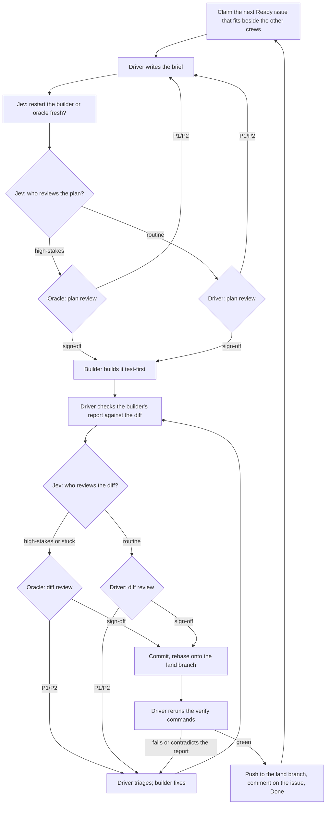

# ai-dev-workflow

Agent skills for building software with crews of coding agents (Claude Code or
Codex), built to need you as little as possible. You give intent; a **steward**
turns it into [Linear](https://linear.app) issues, releases them, and starts
**crews** to build them in parallel. Each crew is a **driver** that leads, a
**builder** that builds, and an **oracle** that reviews the steps that matter.
Every change goes through a reviewed plan and a reviewed diff before it lands.

The sessions run in [Herdr](https://herdr.dev) (a terminal multiplexer for
coding agents) and talk to each other through it. The oracle runs the costliest
model in the loop, so [Jev](https://typesafe.ai), a fast classifier model,
decides which steps it reviews, which issues and questions need you, and when
each session should restart fresh.

| Skill                                                  | What it does                                                                        |
| ------------------------------------------------------ | ----------------------------------------------------------------------------------- |
| [`crew`](skills/crew/SKILL.md)                         | The whole loop: keeps the board, runs crews that plan, build, review and land work. |
| [`linear-migration`](skills/linear-migration/SKILL.md) | Moves a repository's existing plan (ROADMAP, PLAN, HANDOFF, audit) into Linear.     |

## How it works

### The steward and its crews

Run `/crew` once in a repository. That session becomes the **steward**, in your
own checkout, which it never changes. Each pass, it:

- turns your intent (a rough Linear issue, or a line to it in chat) into an
  issue with a goal, observable acceptance criteria and a **footprint**: the
  files it will change;
- sets priority from the goals in the Linear project's description, links
  dependencies and closes duplicates;
- releases each shaped issue to `Ready`, unless Jev rates it high-stakes, in
  which case you get one question with a recommendation;
- works out which `Ready` issues can be built side by side (no overlapping
  footprints, no shared spine like lockfiles or migrations) and starts up to
  `Crews:` crews, each in its own git worktree and Herdr workspace.

Crews claim issues from the shared queue and retire themselves when nothing they
can take remains. Drivers bring the steward their questions about scope and
acceptance; it answers them, and only high-stakes ones reach you.

### Runtimes and models

Each role runs on Claude Code or Codex, set per project with `Runtime:` (below).
The defaults, overridable per role with `Models:`:

| Role    | Claude Code (`Runtime: claude`, the default) | Codex (`Runtime: codex`) |
| ------- | -------------------------------------------- | ------------------------ |
| steward | Opus, high effort                            | GPT-6-Astra, high        |
| driver  | Opus, high                                   | GPT-6-Astra, high        |
| builder | Sonnet, medium                               | GPT-6.1-Sol, medium      |
| oracle  | Fable, high                                  | GPT-6-Astra, xhigh       |

Runtimes can be mixed per role (`Runtime: codex oracle=claude`). The scripts
read each runtime's own session files for context size and token use, so Jev's
restart decisions and the cost log work on both; Codex models are logged in
tokens, without a dollar estimate.

### The three roles in a crew

```text
┌────────────────────────┬────────────────────────┐
│                        │ oracle                 │
│ driver                 │ reviews high-stakes    │
│ picks work, plans,     │ briefs and diffs;      │
│ briefs, reviews the    │ never edits            │
│ routine steps,         ├────────────────────────┤
│ commits and lands      │ builder                │
│ its claimed issue      │ builds one step from   │
│                        │ the brief, test-first  │
└────────────────────────┴────────────────────────┘
```

- **Driver** (left half): the tech lead. It claims the next issue it can build
  beside the other crews, splits multi-step issues into sub-issues, writes each
  step's **brief**, reviews the routine steps itself, triages findings, commits
  and lands. It writes no code itself. When it disputes an oracle finding, it
  argues once with evidence and the oracle's answer stands.
- **Oracle** (top right): an independent reviewer for the steps Jev flags as
  high-stakes. It reads the repository, proves findings with throwaway
  reproductions outside it, and replies with a verdict and findings ranked P1 to
  P3. P1 and P2 block a commit; P3 does not.
- **Builder** (bottom right): builds one step at a time, test-first, and leaves
  its changes uncommitted. Being the cheapest model, it runs the tests; before
  each commit the driver reruns the brief's verify commands once, reading only
  exit codes and summary lines, to check the builder's report.

The layout is fixed: each driver builds it, and restarts happen in place.

### Where Jev comes in

Cheap decisions, made in well under a second each:

- **Who reviews?** Before each plan review and each diff review, Jev scores the
  brief for security, data loss, concurrency, money, contract and architecture
  risk, plus how bad a subtle mistake would be. A high score, or a builder stuck
  on the same failure twice, sends the step to the oracle; everything else the
  driver reviews against the oracle's own checklist. An `oracle` label on an
  issue, or your request, always sends it to the oracle. About one routine step
  in ten goes to the oracle anyway as a spot check.
- **Release, or ask you?** The steward asks Jev whether each shaped issue is
  clear enough to build and whether it is high-stakes (the same risk questions
  as the review gate, with more cautious cutoffs), and whether a driver's
  question needs you or can be settled by the steward. It also asks whether two
  issues are duplicates.
- **Fresh session?** At the start of each step, before plan review, Jev weighs
  each session's context size, whether its recent output looks stuck, and
  whether the next step is related to its recent work, and restarts the builder,
  oracle or driver when a fresh one would do better; the steward checks itself
  after each pass.

Every decision is logged next to what followed (review findings, cost per role,
overrides, disputes, chunk lengths, your feedback, bugs found later), so the
cutoffs can be tuned from evidence. `crewlog.py report` summarizes it;
`crewlog.py replay` re-runs past decisions with other cutoffs.

### One step, end to end

A **step** is one reviewed commit.



### The brief

One text with four uses: Jev gates it, the reviewer approves it, the builder
builds from it, and the Linear issue records it. It names the real risk in plain
words, because Jev reads only what the brief says:

```text
Brief: <ISSUE-ID> <title>
Repository: <path> @ <base commit>
Goal: what changes and why, in a sentence or two.
Acceptance: observable criteria, one per line.
Files: expected changes and new files.
Tests first: each test to write and the behavior it pins; each fails before the change.
Constraints: project rules binding this step; existing patterns to follow (file:line).
Out of scope: what this step leaves alone.
Verify: commands to run from the repository root, each runnable as written, and their expected results.
Stop and report if: conditions where the builder asks instead of choosing.
```

### Chunks and handoffs

A **chunk** is one driver session. When Jev says a fresh driver is due, or you
ask, the driver ends the chunk at a step boundary: it writes the crew's handoff,
has it reviewed, restarts the oracle and builder fresh, starts a new driver, and
hands over once the new one is `READY`. When no issue it can take remains, the
crew retires instead, and the steward closes its worktree.

## Landing work

Set per repository, in `CLAUDE.md`:

- **`Land: crew -> main`** (the default, for anything in production): crews land
  on a shared `crew` branch, so nothing deploys. The steward keeps one release
  PR from `crew` to `main` open, listing every issue it holds and flagging the
  high-stakes ones. **You deploy by merging it**, with a merge commit so the two
  branches stay aligned. Your CI runs on it too. A hotfix pushed to `main` is
  merged back into `crew` on the steward's next pass.
- **`Land: main`** (projects not yet in production): crews rebase, verify and
  push straight to `main`.

Each crew rebases onto the land branch, reruns the verify commands and pushes; a
push that loses a race to another crew simply rebases and verifies again.

## Linear as the queue

One Linear project per repository. You give intent and answer what only you can;
the steward shapes, prioritizes and releases; each driver owns the statuses of
the issue it claimed.

| Status        | Meaning                                  | Set by                                                      |
| ------------- | ---------------------------------------- | ----------------------------------------------------------- |
| `Backlog`     | Intent and discovered work, being shaped | you, the steward; the driver for work it discovers          |
| `Ready`       | Released for building                    | the steward; the driver for sub-issues of a released parent |
| `Planning`    | Brief in plan review                     | driver                                                      |
| `Building`    | Builder building or fixing               | driver                                                      |
| `In Review`   | Diff in review                           | driver                                                      |
| `Needs Input` | Waiting on you                           | steward                                                     |
| `Done`        | Landed on the land branch                | driver                                                      |

- **The Ready gate.** The steward releases routine work itself. Jev sends
  anything high-stakes (security, data loss, money, a public contract,
  architecture) to you instead.
- **Questions.** When only you can decide, the steward comments on the issue
  (the decision, why it is high-stakes, options, recommendation, what it blocks)
  and sets `Needs Input`. Answer with a plain comment.
- **Author prefixes.** Linear shows agent comments under your account, so each
  starts with `[steward]` or `[driver crew-N]`. A comment without one is yours.

## Setup

### Requirements

- [Herdr](https://herdr.dev), with the agents running inside it (`HERDR_ENV=1`):
  Claude Code with access to Opus, Sonnet and Fable, or the Codex CLI, or both.
- A [TypeSafe](https://typesafe.ai) API key for Jev, in `TYPESAFE_API_KEY` or in
  [fnox](https://github.com/jdx/fnox) (project config, or
  `~/.config/fnox/config.toml`).
- [`uv`](https://docs.astral.sh/uv/) (it runs `jev.py` and installs its one
  dependency), Python 3, `git`, and for `Land: crew -> main` the GitHub CLI
  (`gh`).
- For the Linear queue: a Linear workspace, and the Linear MCP server in each
  runtime the steward and drivers use. For Codex:
  `codex mcp add linear --url https://mcp.linear.app/mcp --bearer-token-env-var LINEAR_API_KEY`.
- For Codex: trust the repository once (start Codex in it and accept); crews'
  worktrees inherit that trust.

### Install the skills

```bash
git clone https://github.com/robertguss/ai-dev-workflow.git ~/ai-dev-workflow
mkdir -p ~/.agents/skills ~/.claude/skills
for s in crew linear-migration; do
  ln -s ~/ai-dev-workflow/skills/$s ~/.agents/skills/$s   # Codex
  ln -s ~/ai-dev-workflow/skills/$s ~/.claude/skills/$s   # Claude Code
done
```

### Set up Linear

Make these statuses exist with these exact names: `Backlog`, `Ready`
(Unstarted), `Planning`, `Building`, `In Review`, `Needs Input` (all Started),
`Done`. The steward checks for them and names any that are missing.

### Opt a repository in

Add a `## Crew` section to the repository's root `CLAUDE.md` or `AGENTS.md`:

```text
## Crew

Linear: team <KEY>, project <name>
Land: crew -> main
Crews: 2
Shared: <globs every crew must take turns on, beyond the built-in lockfiles, migrations and CI>
Runtime: codex
```

`Land` defaults to `crew -> main`, `Crews` to 2 and `Runtime` to `claude`;
`Shared` and `Models` are optional. Write the project's goals in the Linear
project's description: the steward prioritizes against them. Leave out `Linear:`
to run a single crew from `HANDOFF.md` alone.

## Day to day

1. Open a Herdr tab in the repository and start the steward's runtime: Claude
   Code with `claude --model opus --effort high`, or Codex with
   `codex -m gpt-6-astra -c model_reasoning_effort="high"`.
2. Run `/crew` (in Codex: "Use the crew skill"). That session becomes the
   steward: it checks the board, shapes and releases what is there, starts crews
   on the project's runtime, and keeps a ticker prompting it for a pass every
   ten minutes so your changes in Linear are picked up.
3. Give it intent: write rough issues in Linear, or tell the steward in its
   pane. It reports each pass in a few lines.
4. Answer the `Needs Input` questions it sends you, in Linear or in its pane.
5. For `Land: crew -> main`, merge the release PR whenever you want a deploy.
6. Ask the steward or a driver how the crews are doing to get
   `crewlog.py report`.

## Moving an existing plan into Linear

If a repository already tracks its work in a ROADMAP, PLAN, HANDOFF or audit
document, ask an agent to use the `linear-migration` skill on it. It inventories
every open task, question and binding rule with its source, asks you only what
only you can decide, creates the project with each source quoted verbatim, has
an oracle review the result, and ends with a **switch-over issue** that the
repository's own driver builds through the normal loop.

Before the first use, copy
[`local.example.md`](skills/linear-migration/local.example.md) to `local.md`
beside it and fill in your workspace's facts. Keep `local.md` out of version
control; this repository's `.gitignore` already does.

## Files

```text
skills/
  crew/
    SKILL.md          the layout, and which file each role follows
    steward.md        shaping, releasing, questions, dispatching crews
    driver.md         the loop, the brief, landing, review requests, logging
    builder.md        build, stop-and-ask, fix rounds, report format
    oracle.md         review phases, severity, reply format
    jev.md            the gate and fresh-session decisions, spot checks, tuning
    linear.md         statuses, queue order, splitting, comments, escalation
    herdr-ops.md      the layout, prompting and reading panes
    end-of-chunk.md   retiring a crew, or the handoff and a replacement driver
    scripts/
      panes.py        builds, checks and restarts a crew's three-pane layout
      crews.py        starts, lists and stops crews in their own worktrees; the steward's ticker
      runtimes.py     Claude Code and Codex: models per role, launch arguments, session files
      parallel.py     which Ready issues can be built beside the work in flight
      jev.py          Jev's review gate, release, escalation, duplicate and fresh-session checks
      verify.py       reruns the verify commands before commit, printing only exit codes and tails
      crewlog.py      the evaluation log, report and threshold replay
  linear-migration/
    SKILL.md          the migration procedure and the pitfalls already hit
    local.example.md  template for your workspace facts (local.md)
    template.py       starting point for a migration script
```

## Status

A young workflow. The crew replaced the earlier driver, oracle and worker skills
in October 2026 and gained the steward and parallel crews soon after; Jev's
cutoffs are first guesses waiting on the log. Expect the skills to change as it
is tuned. Issues and pull requests are welcome.

## License

[MIT](LICENSE)
