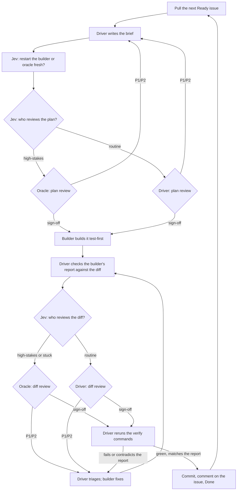

# ai-dev-workflow

Agent skills for building software with a crew of three Claude Code sessions: an
Opus **driver** that leads, a Sonnet **builder** that builds, and a Fable
**oracle** that reviews the steps that matter. Every change goes through a
reviewed plan and a reviewed diff before it is committed, and the work queue
lives in [Linear](https://linear.app), where you decide what gets built.

The sessions run side by side in one [Herdr](https://herdr.dev) tab (Herdr is a
terminal multiplexer for coding agents) and talk to each other through it. Fable
is the costliest model in the loop, so [Jev](https://typesafe.ai), a fast
classifier model, decides which steps it reviews and when each session should
restart fresh.

| Skill                                                  | What it does                                                                          |
| ------------------------------------------------------ | ------------------------------------------------------------------------------------- |
| [`crew`](skills/crew/SKILL.md)                         | The whole loop: lays out the three panes, plans, builds, reviews, commits, hands off. |
| [`linear-migration`](skills/linear-migration/SKILL.md) | Moves a repository's existing plan (ROADMAP, PLAN, HANDOFF, audit) into Linear.       |

## How it works

### The three roles

```text
┌────────────────────────┬────────────────────────┐
│                        │ oracle (Fable)         │
│ driver (Opus)          │ reviews high-stakes    │
│ picks work, plans,     │ briefs and diffs;      │
│ briefs, reviews the    │ never edits            │
│ routine steps,         ├────────────────────────┤
│ commits; the only      │ builder (Sonnet)       │
│ agent that writes to   │ builds one step from   │
│ Linear                 │ the brief, test-first  │
└────────────────────────┴────────────────────────┘
```

- **Driver** (left half, Opus): the tech lead. It takes the next released issue,
  splits multi-step issues into sub-issues, writes each step's **brief**,
  reviews the routine steps itself, triages findings, and commits. It writes no
  code itself.
- **Oracle** (top right, Fable): an independent reviewer for the steps Jev flags
  as high-stakes. It reads the repository, proves findings with throwaway
  reproductions outside it, and replies with a verdict and findings ranked P1 to
  P3. P1 and P2 block a commit; P3 does not.
- **Builder** (bottom right, Sonnet): builds one step at a time, test-first, and
  leaves its changes uncommitted. Being the cheapest model, it runs the tests;
  before each commit the driver reruns the brief's verify commands once, reading
  only exit codes and summary lines, to check the builder's report.

The layout is fixed: `/crew` builds it, and restarts happen in place.

### Where Jev comes in

Two cheap decisions, made in well under a second each:

- **Who reviews?** Before each plan review and each diff review, Jev scores the
  brief for security, data loss, concurrency, money, contract and architecture
  risk, plus how bad a subtle mistake would be. A high score, or a builder stuck
  on the same failure twice, sends the step to the oracle; everything else the
  driver reviews against the oracle's own checklist. An `oracle` label on an
  issue, or your request, always sends it to the oracle. About one routine step
  in ten goes to the oracle anyway as a spot check.
- **Fresh session?** At the start of each step, before plan review, Jev weighs each session's context
  size, whether its recent output looks stuck, and whether the next step is
  related to its recent work, and restarts the builder, oracle or driver when a
  fresh one would do better.

Every decision is logged next to what followed (review findings, cost per role,
overrides, your feedback, bugs found later), so the cutoffs can be tuned from
evidence. `crewlog.py report` summarizes it; `crewlog.py replay` re-runs past
decisions with other cutoffs.

### One step, end to end

A **step** is one reviewed commit.



### The brief

One text with four uses: Jev gates it, the reviewer approves it, the builder
builds from it, and the Linear issue records it. It names the real risk in plain
words, because Jev reads only what the brief says:

```text
Brief: <ISSUE-ID> <title>
Repository: <path> @ <base commit>
Goal: what changes and why, in a sentence or two.
Acceptance: observable criteria, one per line.
Files: expected changes and new files.
Tests first: each test to write and the behavior it pins; each fails before the change.
Constraints: project rules binding this step; existing patterns to follow (file:line).
Out of scope: what this step leaves alone.
Verify: commands to run from the repository root, each runnable as written, and their expected results.
Stop and report if: conditions where the builder asks instead of choosing.
```

### Chunks and handoffs

A **chunk** is one driver session. When Jev says a fresh driver is due, the
queue is empty, or you ask, the driver ends the chunk at a step boundary: it
writes `HANDOFF.md`, has it reviewed and commits it, restarts the oracle and
builder fresh, starts a new driver, and hands over once the new one is `READY`.

## Linear as the queue

One Linear project per repository. You own priority, order, scope and what is
released; the driver owns every status after `Ready`.

| Status        | Meaning                                  | Set by                                                                                    |
| ------------- | ---------------------------------------- | ----------------------------------------------------------------------------------------- |
| `Backlog`     | Ideas and discovered work; not buildable | you; the driver for work it discovers                                                     |
| `Ready`       | Released for building                    | you; the driver for sub-issues of a released parent and for answered `Needs Input` issues |
| `Planning`    | Brief in plan review                     | driver                                                                                    |
| `Building`    | Builder building or fixing               | driver                                                                                    |
| `In Review`   | Diff in review                           | driver                                                                                    |
| `Needs Input` | Waiting on you                           | driver                                                                                    |
| `Done`        | Committed                                | driver                                                                                    |

- **The Ready gate.** Agents build only what you moved to `Ready`. Work the
  driver discovers mid-step goes to `Backlog` with a note, for you to release.
- **Questions.** When only you can decide, the driver comments on the issue
  (question, options, recommendation, what it blocks) and sets `Needs Input`.
- **`[driver]` prefix.** Linear shows the driver's comments under your account,
  so every comment it posts starts with `[driver]`. An unprefixed comment is
  yours.

## Setup

### Requirements

- [Herdr](https://herdr.dev), with Claude Code running inside it
  (`HERDR_ENV=1`), and access to Opus, Sonnet and Fable.
- A [TypeSafe](https://typesafe.ai) API key for Jev, in `TYPESAFE_API_KEY` or in
  [fnox](https://github.com/jdx/fnox) (project config, or
  `~/.config/fnox/config.toml`).
- [`uv`](https://docs.astral.sh/uv/) (it runs `jev.py` and installs its one
  dependency), Python 3, and `git`.
- For the Linear queue: a Linear workspace, and the Linear MCP server or a
  Linear API key for the driver.

### Install the skills

```bash
git clone https://github.com/robertguss/ai-dev-workflow.git ~/ai-dev-workflow
mkdir -p ~/.claude/skills
for s in crew linear-migration; do
  ln -s ~/ai-dev-workflow/skills/$s ~/.claude/skills/$s
done
```

### Set up Linear

Make these statuses exist with these exact names: `Backlog`, `Ready`
(Unstarted), `Planning`, `Building`, `In Review`, `Needs Input` (all Started),
`Done`. The driver checks for them and names any that are missing.

### Opt a repository in

Add a `## Crew` section to the repository's root `CLAUDE.md`:

```text
## Crew

Linear: team <KEY>, project <name>
```

Leave out `Linear:` to run from `HANDOFF.md` alone.

## Day to day

1. Open a Herdr tab in the repository and start Claude Code with
   `claude --model opus --effort high`.
2. Run `/crew`. It builds the layout, starting the oracle and builder with your
   permission mode, reads `CLAUDE.md` and `HANDOFF.md`, and checks the checkout.
3. Write issues in Linear and move the ones you want built to `Ready`. The
   driver works through them, reporting each review decision and status change
   in a line.
4. Answer `Needs Input` questions in Linear or in the driver's pane. Outward
   actions (push, merge, deploy) stay yours to authorize, per the project's own
   rules.
5. Ask the driver how the crew is doing to get `crewlog.py report`.

## Moving an existing plan into Linear

If a repository already tracks its work in a ROADMAP, PLAN, HANDOFF or audit
document, ask an agent to use the `linear-migration` skill on it. It inventories
every open task, question and binding rule with its source, asks you only what
only you can decide, creates the project with each source quoted verbatim, has
an oracle review the result, and ends with a **switch-over issue** that the
repository's own driver builds through the normal loop.

Before the first use, copy
[`local.example.md`](skills/linear-migration/local.example.md) to `local.md`
beside it and fill in your workspace's facts. Keep `local.md` out of version
control; this repository's `.gitignore` already does.

## Files

```text
skills/
  crew/
    SKILL.md          the layout, and which file each role follows
    driver.md         the loop, the brief, review requests, logging
    builder.md        build, stop-and-ask, fix rounds, report format
    oracle.md         review phases, severity, reply format
    jev.md            the gate and fresh-session decisions, spot checks, tuning
    linear.md         statuses, queue order, splitting, comments, escalation
    herdr-ops.md      the layout, prompting and reading panes
    end-of-chunk.md   HANDOFF.md, its review, restarting the crew
    scripts/
      panes.py        builds, checks and restarts the three-pane layout
      jev.py          Jev's review gate and fresh-session check
      verify.py       reruns the verify commands before commit, printing only exit codes and tails
      crewlog.py      the evaluation log, report and threshold replay
  linear-migration/
    SKILL.md          the migration procedure and the pitfalls already hit
    local.example.md  template for your workspace facts (local.md)
    template.py       starting point for a migration script
```

## Status

A young workflow. The crew replaced the earlier driver, oracle and worker skills
in October 2026, and Jev's cutoffs are first guesses waiting on the log. Expect
the skills to change as it is tuned. Issues and pull requests are welcome.

## License

[MIT](LICENSE)
